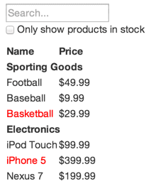

> React 最棒的部分之一是引导我们思考如何构建一个应用。
### 从设计稿开始
<!--  -->


对应数据：
```
[
  {category: "Sporting Goods", price: "$49.99", stocked: true, name: "Football"},
  {category: "Sporting Goods", price: "$9.99", stocked: true, name: "Baseball"},
  {category: "Sporting Goods", price: "$29.99", stocked: false, name: "Basketball"},
  {category: "Electronics", price: "$99.99", stocked: true, name: "iPod Touch"},
  {category: "Electronics", price: "$399.99", stocked: false, name: "iPhone 5"},
  {category: "Electronics", price: "$199.99", stocked: true, name: "Nexus 7"}
];
```

### 一：将设计好的 UI 划分为组件层级
将组件当作一种函数或者是对象来考虑，根据单一功能原则来判定组件的范围。一个组件原则上只能负责一个功能。如果它需要负责更多的功能，这时候就应该考虑将它拆分成更小的组件。将 UI 分离为组件，其中每个组件需与数据模型的某部分匹配。

1. FilterableProductTable (橙色): 是整个示例应用的整体
2. SearchBar (蓝色): 接受所有的用户输入
3. ProductTable (绿色): 展示数据内容并根据用户输入筛选结果
4. ProductCategoryRow (天蓝色): 为每一个产品类别展示标题
5. ProductRow (红色): 每一行展示一个产品

- FilterableProductTable
  - SearchBar
  - ProductTable
    - ProductCategoryRow
    - ProductRow

### 二：用 React 创建一个静态版本
先用已有的数据模型渲染一个不包含交互功能的 UI。最好将渲染 UI 和添加交互这两个过程分开。这是因为，编写一个应用的静态版本时，往往要编写大量代码，而不需要考虑太多交互细节；添加交互功能时则要考虑大量细节，而不需要编写太多代码。所以，将这两个过程分开进行更为合适。

在构建应用的静态版本时，我们需要创建一些会重用其他组件的组件，然后通过 props 传入所需的数据。props 是父组件向子组件传递数据的方式。即使你已经熟悉了 state 的概念，也完全不应该使用 state 构建静态版本。state 代表了随时间会产生变化的数据，应当仅在实现交互时使用。所以构建应用的静态版本时，你不会用到它。

你可以自上而下或者自下而上构建应用：自上而下意味着首先编写层级较高的组件（比如 FilterableProductTable），自下而上意味着从最基本的组件开始编写（比如 ProductRow）。当你的应用比较简单时，使用自上而下的方式更方便；对于较为大型的项目来说，自下而上地构建，并同时为低层组件编写测试是更加简单的方式。

到此为止，你应该已经有了一个可重用的组件库来渲染你的数据模型。由于我们构建的是静态版本，所以这些组件目前只需提供 render() 方法用于渲染。最顶层的组件 FilterableProductTable 通过 props 接受你的数据模型。如果你的数据模型发生了改变，再次调用 ReactDOM.render()，UI 就会相应地被更新。数据模型变化、调用 render() 方法、UI 相应变化，这个过程并不复杂，因此很容易看清楚 UI 是如何被更新的，以及是在哪里被更新的。React 单向数据流（也叫单向绑定）的思想使得组件模块化，易于快速开发。

### 三：确定 UI state 的最小（且完整）表示
想要使你的 UI 具备交互功能，需要有触发基础数据模型改变的能力。React 通过实现 state 来完成这个任务。

为了正确地构建应用，你首先需要找出应用所需的 state 的最小表示，并根据需要计算出其他所有数据。其中的关键正是 DRY: Don’t Repeat Yourself。只保留应用所需的可变 state 的最小集合，其他数据均由它们计算产生。比如，你要编写一个任务清单应用，你只需要保存一个包含所有事项的数组，而无需额外保存一个单独的 state 变量（用于存储任务个数）。当你需要展示任务个数时，只需要利用该数组的 length 属性即可。

我们的示例应用拥有如下数据：

- 包含所有产品的原始列表
- 用户输入的搜索词
- 复选框是否选中的值
- 经过搜索筛选的产品列表

通过问自己以下三个问题，你可以逐个检查相应数据是否属于 state：

1. 该数据是否是由父组件通过 props 传递而来的？如果是，那它应该不是 state。
2. 该数据是否随时间的推移而保持不变？如果是，那它应该也不是 state。
3. 你能否根据其他 state 或 props 计算出该数据的值？如果是，那它也不是 state。

包含所有产品的原始列表是经由 props 传入的，所以它不是 state；搜索词和复选框的值应该是 state，因为它们随时间会发生改变且无法由其他数据计算而来；经过搜索筛选的产品列表不是 state，因为它的结果可以由产品的原始列表根据搜索词和复选框的选择计算出来。

综上所述，属于 state 的有：

1. 用户输入的搜索词
2. 复选框是否选中的值

### 四：确定 state 放置的位置
确定哪个组件能够改变这些 state，或者说拥有这些 state。
> React 中的数据流是单向的，并顺着组件层级从上往下传递。

对于应用中的每一个 state：

- 找到根据这个 state 进行渲染的所有组件。
- 找到他们的共同所有者（common owner）组件（在组件层级上高于所有需要该 state 的组件）。
- 该共同所有者组件或者比它层级更高的组件应该拥有该 state。
- 如果你找不到一个合适的位置来存放该 state，就可以直接创建一个新的组件来存放该 state，并将这一新组件置于高于共同所有者组件层级的位置。

根据以上策略重新考虑我们的示例应用：

- ProductTable 需要根据 state 筛选产品列表。SearchBar 需要展示搜索词和复选框的状态。
- 他们的共同所有者是 FilterableProductTable。
- 因此，搜索词和复选框的值应该很自然地存放在 FilterableProductTable 组件中。

很好，我们已经决定把这些 state 存放在 FilterableProductTable 组件中。首先，将实例属性 this.state = {filterText: '', inStockOnly: false} 添加到 FilterableProductTable 的 constructor 中，设置应用的初始 state；接着，将 filterText 和 inStockOnly 作为 props 传入 ProductTable 和 SearchBar；最后，用这些 props 筛选 ProductTable 中的产品信息，并设置 SearchBar 的表单值。

### 五：添加反向数据流
到目前为止，我们已经借助自上而下传递的 props 和 state 渲染了一个应用。现在，我们将尝试让数据反向传递：处于较低层级的表单组件更新较高层级的 FilterableProductTable 中的 state。

React 通过一种比传统的双向绑定略微繁琐的方法来实现反向数据传递。尽管如此，但这种需要显式声明的方法更有助于人们理解程序的运作方式。

每当用户改变表单的值，我们需要改变 state 来反映用户的当前输入。由于 state 只能由拥有它们的组件进行更改，FilterableProductTable 必须将一个能够触发 state 改变的回调函数（callback）传递给 SearchBar。我们可以使用输入框的 onChange 事件来监视用户输入的变化，并通知 FilterableProductTable 传递给 SearchBar 的回调函数。然后该回调函数将调用 setState()，从而更新应用。